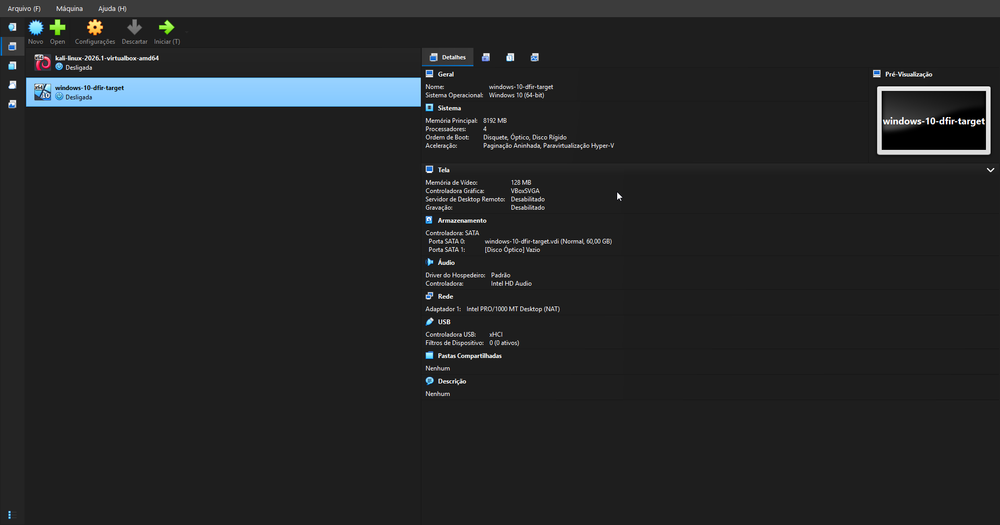
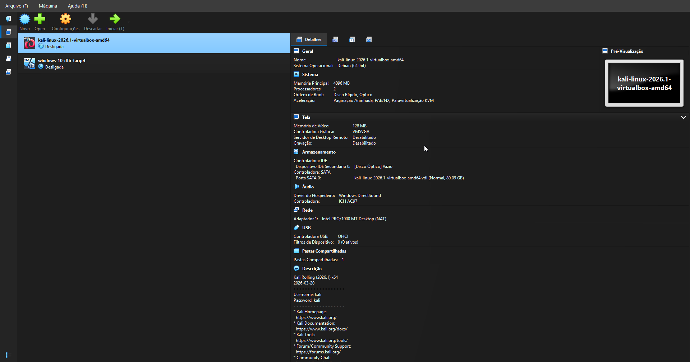
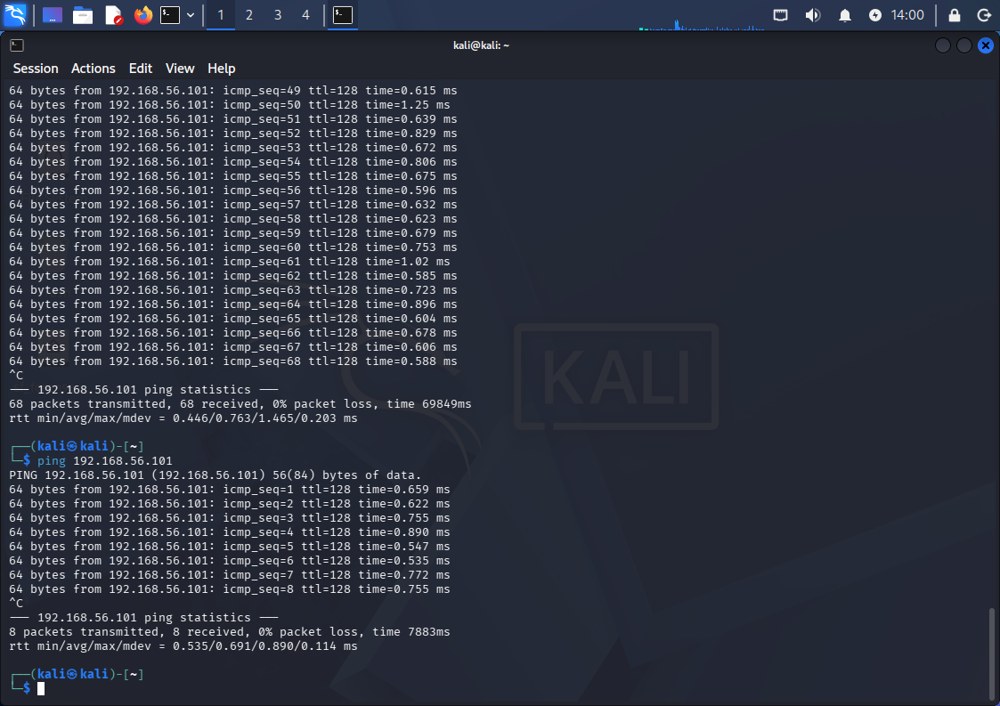
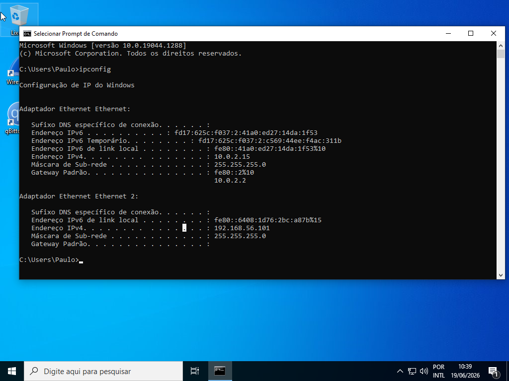

# Phase 01 — Environment Setup

## Objective

Configure an isolated forensic lab environment consisting of two virtual machines: a Windows 10 target machine running qBittorrent, and a Kali Linux investigator machine. The environment is designed to simulate a real-world DFIR scenario where the investigator operates separately from the target system, maintaining forensic integrity throughout the investigation.

---

## Environment Overview

```
VirtualBox Host (Windows — Ryzen 7 5700X, 32GB RAM)
│
├── VM1: windows-10-dfir-target  (suspect machine)
│   ├── OS: Windows 10 Enterprise LTSC 21H2
│   ├── Adapter 1 (NAT)       → internet access for torrent download
│   └── Adapter 2 (Host-only) → 192.168.56.101 — forensic network
│
└── VM2: kali-linux-2026.1-virtualbox-amd64  (investigator machine)
    ├── OS: Kali Linux Rolling 2026.1 x64
    ├── Adapter 1 (NAT)       → internet access
    └── Adapter 2 (Host-only) → 192.168.56.102 — forensic network
```

---

## Software Versions

| Component | Version |
|---|---|
| Oracle VirtualBox | 7.2.8 r173730 (Qt6.8.0) |
| Windows 10 Enterprise LTSC | 21H2 (10.0.19044.1288) |
| Kali Linux | Rolling 2026.1 x64 |
| qBittorrent | 5.2.2 x64 |
| Wireshark | 4.6.6 x64 |

---

## VM Specifications

### windows-10-dfir-target

| Parameter | Value |
|---|---|
| RAM | 8192 MB |
| CPUs | 4 |
| Disk | 60 GB (dynamic VDI) |
| Network Adapter 1 | NAT — internet access |
| Network Adapter 2 | Host-only — 192.168.56.101 / 255.255.255.0 |
| OS User | Paulo |



### kali-linux-2026.1-virtualbox-amd64

| Parameter | Value |
|---|---|
| RAM | 4096 MB |
| CPUs | 2 |
| Disk | 80 GB (dynamic VDI) |
| Network Adapter 1 | NAT — internet access |
| Network Adapter 2 | Host-only — 192.168.56.102 / 255.255.255.0 |



---

## Network Architecture

Two network adapters were configured on each VM:

**NAT (Adapter 1)** — provides internet access to the Windows target, allowing the qBittorrent client to connect to trackers and peers during evidence generation. The Kali machine also has NAT for tool updates if needed.

**Host-only (Adapter 2)** — creates a private isolated network between the two VMs and the host machine, with no external routing. This is the forensic acquisition network used in Phase 03, when Kali will access the Windows disk image over this interface. No internet traffic flows through this adapter.

---

## Connectivity Verification

Ping test from Kali to Windows target confirmed successful communication over the Host-only network:

```bash
┌──(kali㉿kali)-[~]
└─$ ping 192.168.56.101
PING 192.168.56.101 (192.168.56.101) 56(84) bytes of data.
64 bytes from 192.168.56.101: icmp_seq=1 ttl=128 time=1.27 ms
64 bytes from 192.168.56.101: icmp_seq=2 ttl=128 time=0.577 ms
64 bytes from 192.168.56.101: icmp_seq=3 ttl=128 time=0.669 ms
64 bytes from 192.168.56.101: icmp_seq=4 ttl=128 time=0.878 ms
64 bytes from 192.168.56.101: icmp_seq=5 ttl=128 time=0.708 ms
```

Latency ~0.6ms confirms a stable low-latency link suitable for forensic acquisition.





---

## Forensic Rationale

**Why a dedicated VM instead of the host machine?**
Using an isolated VM as the target ensures a clean disk state from the start. No pre-existing artifacts from personal use, no registry noise, no unrelated browser history. Every artifact found during analysis in Phase 04 was generated by this investigation — nothing else. This makes the timeline in Phase 06 surgically precise and legally defensible.

**Why two separate network adapters?**
The NAT adapter allows realistic torrent traffic to occur (connecting to real trackers and peers), while the Host-only adapter keeps the forensic acquisition channel completely isolated from the internet. This mirrors real-world incident response architecture where the investigator never contaminates the evidence network.

**Why a static IP on the Host-only adapter?**
VirtualBox's Host-only network does not always assign IPs via DHCP reliably. A static IP (192.168.56.101) was manually configured on the Windows target to guarantee stable communication with the Kali investigator machine across sessions.

**Snapshot policy**
Two snapshots were taken during this phase:
- `clean-install` — taken immediately after Windows installation, before any software was installed
- `network-configured` — taken after qBittorrent installation and network configuration was complete

Snapshots document the pre-incident state and allow rollback if the environment needs to be reproduced.

---

## Troubleshooting

### Issue 1 — Host-only network not responding (Destination Host Unreachable)

**Symptom:** Ping from Kali to Windows returned `Destination Host Unreachable` despite both VMs being on the same Host-only subnet.

**Initial hypothesis:** Windows Firewall blocking ICMP. Disabled firewall for private networks and added an ICMP inbound rule via `netsh` — issue persisted.

**Root cause:** The Windows Host-only adapter (Ethernet 2) had no IPv4 address assigned. VirtualBox's Host-only DHCP server did not assign an address automatically in this configuration. The adapter was active and the cable was virtually connected, but without an IP it could not participate in the subnet.

**Resolution:** Manually configured a static IPv4 address on Ethernet 2:
- IP: `192.168.56.101`
- Subnet mask: `255.255.255.0`
- Gateway: (none)

Ping succeeded immediately after applying the static IP. The firewall was then re-enabled, with only the `File and Printer Sharing (Echo Request - ICMPv4-In)` inbound rule enabled to allow ping while keeping the firewall active.

**Lesson:** In Host-only networks, always verify that the target adapter has an IP assigned. DHCP on Host-only adapters is not guaranteed — static assignment is more reliable for forensic lab environments.

---

### Issue 2 — VirtualBox Guest Additions installation friction

**Context:** Attempted to install VirtualBox Guest Additions on the Windows target to enable clipboard sharing and drag-and-drop between host and VM.

**What happened:** After mounting the Guest Additions ISO via `Devices → Insert Guest Additions CD Image`, the installer was located and executed (`VBoxWindowsAdditions.exe`). The installation process generated errors related to the guest environment.

**Decision:** Guest Additions are not required for this project. The Windows target only needs to run qBittorrent and generate artifacts — no file transfer between host and VM is needed during evidence generation. Screenshots of the Windows VM are captured via VirtualBox's built-in `View → Take Screenshot` function. This decision keeps the target disk cleaner and reduces non-investigative artifacts.

---

## Next Phase

With the environment fully configured and connectivity verified, Phase 02 begins: launching Wireshark on the Windows target, initiating a torrent download of a legitimate Linux distribution, and capturing all network traffic for later analysis.

→ [Phase 02 — Evidence Generation](../phase02-evidence-generation/README.md)
