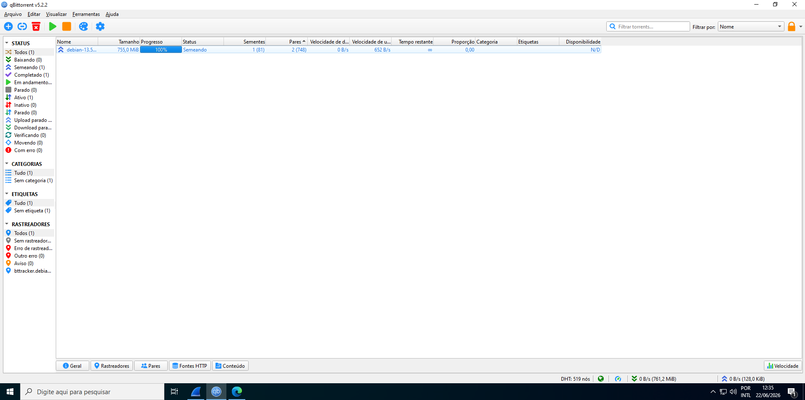
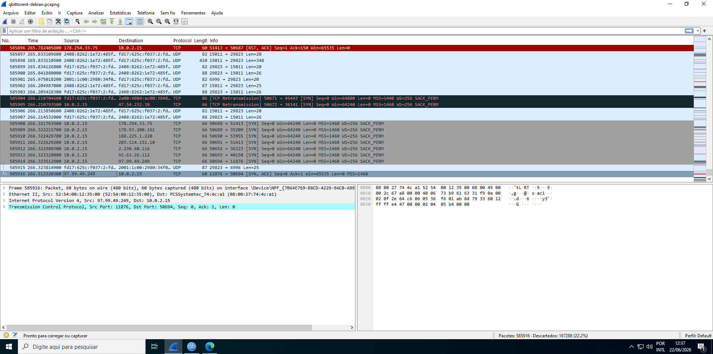

# Phase 02 — Evidence Generation

## Objective

Generate realistic forensic evidence by downloading a legitimate torrent file on the Windows target machine while capturing all network traffic with Wireshark. This phase simulates the suspect's activity that will be investigated in later phases.

---

## Environment

- **Target machine:** windows-10-dfir-target (192.168.56.101)
- **Torrent client:** qBittorrent v5.2.2 x64
- **Network capture tool:** Wireshark 4.6.6 x64
- **Torrent downloaded:** debian-13.5.0-amd64-netinst.iso (755 MiB)
- **Tracker:** bttracker.debian.org (official Debian tracker)

---

## Activity Timeline

| Time | Event |
|---|---|
| 12:27 | Wireshark capture started on active network interface |
| 12:28 | qBittorrent opened |
| 12:29 | Torrent added — debian-13.5.0-amd64-netinst.iso |
| ~12:31 | Download completed (755 MiB) |
| 12:32 | Wireshark capture stopped and saved |

Total capture window: ~5 minutes.

---

## Procedure

### 1. Wireshark capture

Wireshark was started **before** opening qBittorrent to ensure the full session was captured from the first packet — including DNS resolution of the tracker hostname, the initial TCP handshake with the tracker, and the first peer connections.

Capture was performed on the NAT interface (the adapter with internet access), where all BitTorrent traffic flows.

### 2. Torrent download

qBittorrent was opened and the Debian torrent was added. The client immediately contacted the official Debian tracker (`bttracker.debian.org`) and began connecting to peers via the BitTorrent swarm.

Key observations during download:
- DHT active with 519 nodes
- 2 active peers connected during download (748 peers in the swarm)
- Upload activity observed post-completion (seeding state)

### 3. Capture saved

After download completion, Wireshark was stopped and the capture was saved as:

```
qbitorrent-debian.pcapng
```

> Note: file saved in `.pcapng` format (PCAPng — next generation), which is the default format in Wireshark 4.x. Functionally equivalent to `.pcap` for analysis purposes.

---

## Capture Statistics

| Metric | Value |
|---|---|
| Total packets captured | 585,916 |
| Packets discarded | 167,288 (22.2%) |
| Capture duration | ~5 minutes |
| File format | PCAPng |

---

## Screenshots

### qBittorrent — download completed



Torrent at 100%, status **Seeding**. Tracker and DHT both active. 2 peers connected, 748 in swarm.

### Wireshark — capture overview



585,916 packets captured. Mix of TCP (peer connections) and UDP (DHT traffic) visible. Multiple external IPs identified as peers:

| IP | Role |
|---|---|
| 178.254.33.75 | peer |
| 178.93.200.161 | peer |
| 188.225.1.220 | peer |
| 203.114.151.10 | peer |
| 2.230.60.116 | peer |
| 97.99.49.249 | peer |

These IPs will be cross-referenced with disk artifacts and Registry timestamps in Phase 06.

---

## Forensic Rationale

**Why start Wireshark before qBittorrent?**
Starting the capture first ensures no packets are missed. The most forensically relevant events — DNS resolution of the tracker, the initial TCP SYN to the tracker, the peer handshake — happen in the first seconds. Missing them would leave gaps in the timeline.

**Why use a legitimate torrent?**
Using an official Debian ISO torrent ensures the activity is legal, reproducible, and verifiable. The Debian tracker is public and well-documented, making it easy to validate tracker behavior in the pcap analysis.

**Why does download speed matter forensically?**
It doesn't — what matters is that the activity occurred and was captured. High download speed (755 MiB in ~2 minutes) means the download completed well within the capture window, so the full session from torrent-added to seeding is represented in the pcap.

---

## Artifacts Generated

The following artifacts were created on the Windows target disk during this phase and will be located during Phase 04 disk analysis:

- `.torrent` file or magnet link reference stored by qBittorrent
- qBittorrent configuration and history files (`%APPDATA%\qBittorrent\`)
- Downloaded file: `debian-13.5.0-amd64-netinst.iso`
- Windows Registry entries: UserAssist, MuiCache (qBittorrent execution evidence)
- NTFS timestamps on all created files

---

## Next Phase

With evidence generated and network capture saved, Phase 03 begins: forensic acquisition of the Windows target disk using `ewfacquire`, SHA-256 hash verification, and chain of custody documentation.

→ [Phase 03 — Forensic Acquisition](../phase03-forensic-acquisition/phase03-forensic-acquisition.md)
