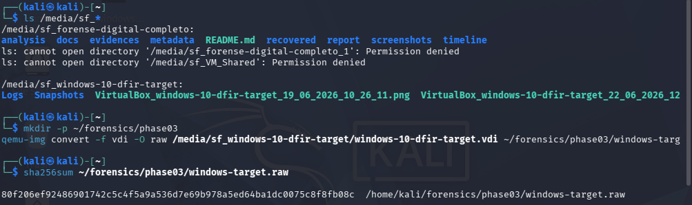
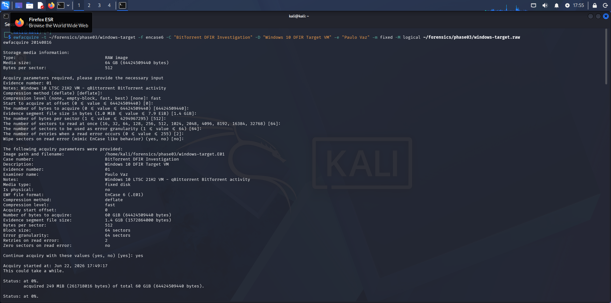
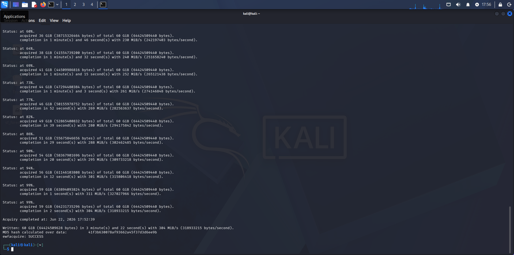
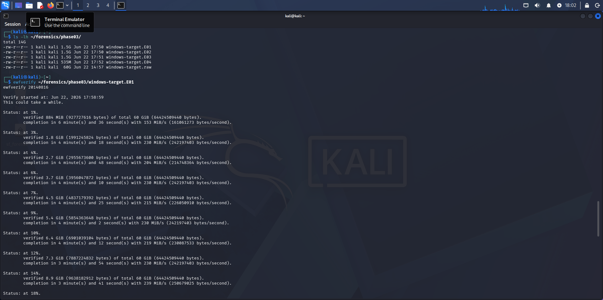
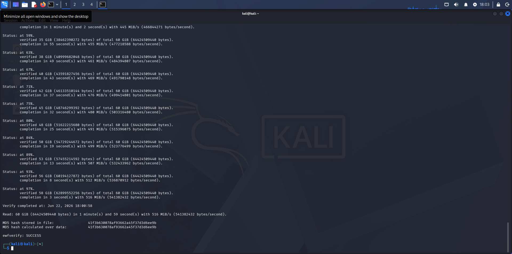
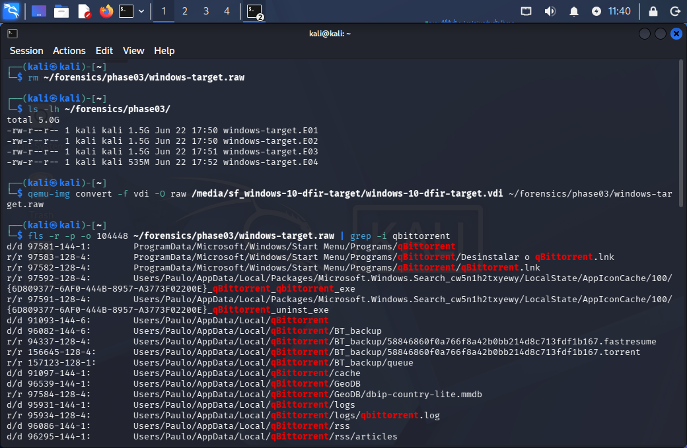
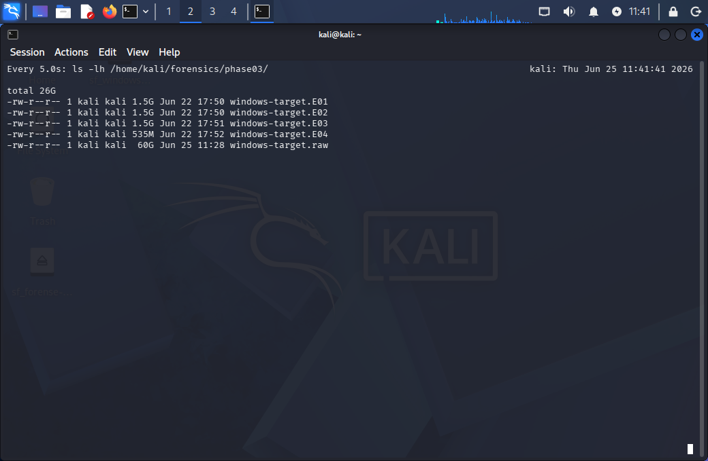
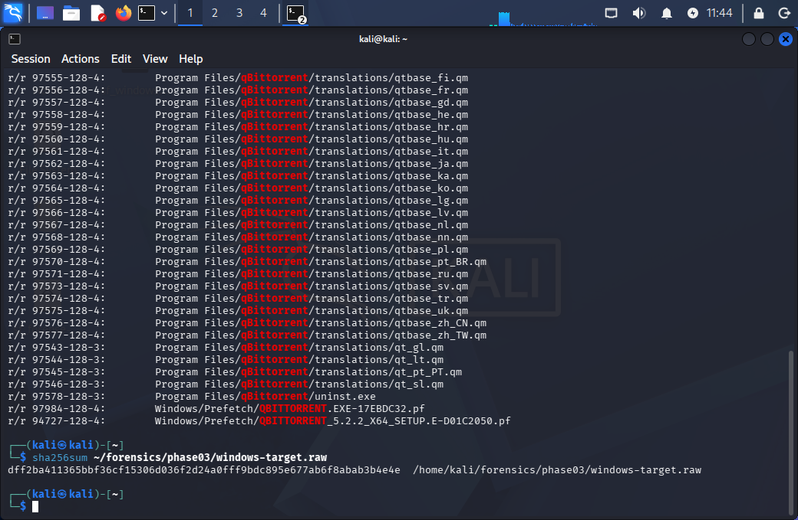
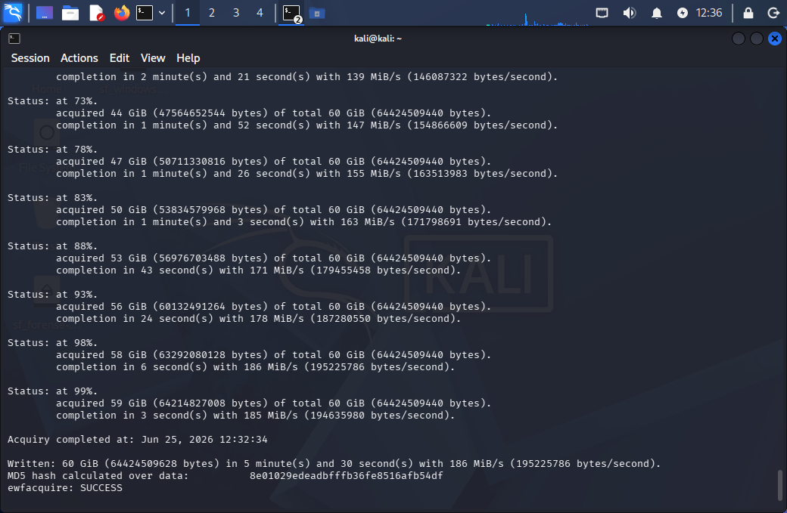
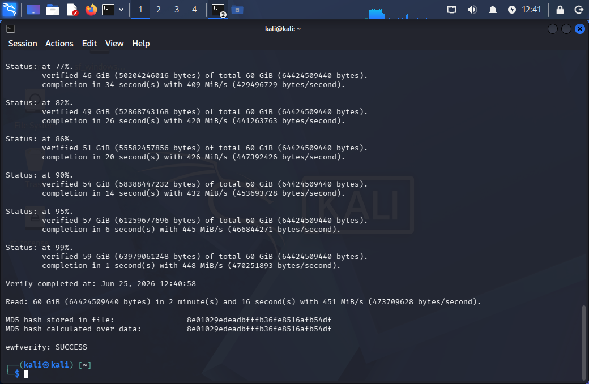

# Phase 03 — Forensic Acquisition

## Objective

Create a forensically sound image of the Windows target disk, verify its integrity through cryptographic hashing, and document the full chain of custody. The resulting E01 image will be used as the primary evidence source for all subsequent analysis phases.

> **Note:** This phase required two acquisition attempts. The first acquisition captured the wrong disk state due to VirtualBox snapshot architecture. The full troubleshooting process is documented below as it represents real-world forensic investigative reasoning.

---

## Environment

- **Investigator machine:** kali-linux-2026.1-virtualbox-amd64
- **Target machine:** windows-10-dfir-target (powered off during acquisition)
- **Acquisition tool:** ewfacquire 20140816
- **Verification tool:** ewfverify 20140816
- **Conversion tool:** qemu-img (QEMU disk image utility)
- **Source file:** `windows-10-dfir-target.vdi` (VirtualBox dynamic disk)
- **Output format:** EnCase 6 (.E01)

---

## Pre-Acquisition Checklist

- [x] Windows target VM powered off — disk is static, no writes occurring
- [x] VDI file accessible via VirtualBox shared folder at `/media/sf_windows-10-dfir-target/`
- [x] `ewfacquire` and `qemu-img` confirmed installed on Kali
- [x] Output directory created: `~/forensics/phase03/`

---

## Acquisition 01 — Initial Attempt (Incorrect)

### Step 1 — Convert VDI to raw image

```bash
mkdir -p ~/forensics/phase03
qemu-img convert -f vdi -O raw \
  /media/sf_windows-10-dfir-target/windows-10-dfir-target.vdi \
  ~/forensics/phase03/windows-target.raw
```

The resulting raw image appeared as a sparse file — logical size 60GB, physical size ~8.7GB.

### Step 2 — SHA-256 hash of raw image

```bash
sha256sum ~/forensics/phase03/windows-target.raw
```

**SHA-256 (raw v1):**
```
80f206ef92486901742c5c4f5a9a536d7e69b978a5ed64ba1dc0075c8f8fb08c
```



### Step 3 — Acquire E01

```bash
ewfacquire \
  -t ~/forensics/phase03/windows-target \
  -f encase6 \
  -C "BitTorrent DFIR Investigation" \
  -D "Windows 10 DFIR Target VM" \
  -e "Paulo Vaz" \
  -m fixed \
  -M logical \
  ~/forensics/phase03/windows-target.raw
```

**Result:**
```
Acquiry completed at: Jun 22, 2026 17:52:39
Written: 60 GiB in 3 minute(s) and 22 second(s) with 304 MiB/s
MD5 hash calculated over data: 41f3b630078af93662a45f37d3d6ee9b
ewfacquire: SUCCESS
```




### Step 4 — Verify E01 integrity

```
Verify completed at: Jun 22, 2026 18:00:58
MD5 hash stored in file:        41f3b630078af93662a45f37d3d6ee9b
MD5 hash calculated over data:  41f3b630078af93662a45f37d3d6ee9b
ewfverify: SUCCESS
```




---

## Troubleshooting — Wrong Disk State Acquired

### Discovery

During Phase 04 disk analysis, TSK found no qBittorrent artifacts anywhere on the acquired image:

```bash
fls -r -p -o 104448 ~/forensics/phase03/windows-target.raw | grep -i qbittorrent
# (empty output)
```

No `.torrent` files, no qBittorrent installation, no AppData entries — despite the software having been installed and used to download a 755MB file.

### Root Cause — VirtualBox Snapshot Architecture

VirtualBox uses a **differential disk architecture** for snapshots. When a snapshot is taken, the base VDI is frozen at that exact state and all subsequent writes go to a new differential VDI stored in the `Snapshots/` folder. The base VDI is never modified again.

The snapshot chain for this VM was:

```
windows-10-dfir-target.vdi  ← frozen at clean-install (Jun 18, 2026)
         ↓
{4b452df5...}.vdi  ← dependencies-installed
         ↓
{f7eadf86...}.vdi  ← guest-additions-fixed
         ↓
{7e38a98b...}.vdi  ← network-configured
         ↓
{d65e0302...}.vdi  ← wireshark-done
         ↓
{f8e3eb22...}.vdi  ← Estado Atual — qBittorrent + torrent download (15.7 GiB)
```

The first acquisition pointed to `windows-10-dfir-target.vdi` — the frozen base disk from before any software was installed. All actual evidence resided in the snapshot chain, specifically in `{f8e3eb22...}.vdi`.

### Forensic Lesson — VM vs Physical Disk

> **Important disclaimer:** This problem is specific to virtualized environments. In a physical disk investigation, a hardware write blocker guarantees the original evidence remains unmodified regardless of what operations are performed on the acquired copy. There is no equivalent of "snapshots" on a physical disk — the disk is always the single source of truth.
>
> In VM forensics, identifying and correctly handling snapshot chains is a critical skill. Acquiring only the base VDI without accounting for differential snapshots is a common mistake that results in an incomplete or incorrect evidence image.

### Correct Approach (Lesson Learned)

The forensically sound approach for VM snapshot chains would have been:

1. Leave all files untouched
2. Point `qemu-img` directly at the most recent snapshot VDI (`{f8e3eb22...}.vdi`) — `qemu-img` resolves the differential chain automatically
3. Generate raw and E01 from that without modifying the original evidence

### What Was Done Instead

To simplify the workflow, VirtualBox snapshots were consolidated into the base VDI by deleting snapshots from oldest to newest. VirtualBox automatically merges each snapshot's changes into the next level during deletion.

**Before consolidation:** `windows-10-dfir-target.vdi` = 9.2 GiB (frozen at clean-install)
**After consolidation:** `windows-10-dfir-target.vdi` = ~21 GiB (full state with all activity)

**Why this is problematic forensically:** Consolidating snapshots modifies the base VDI — the original evidence state is altered. In a real court case, this could be challenged.

**What preserved the chain of custody:** Before consolidation, a full backup of the entire `windows-10-dfir-target/` folder — including all snapshot VDIs — was made to two separate storage devices (external HD and USB drive formatted as exFAT). The original snapshot chain is preserved and verifiable.

### TSK Confirmation Before Second Acquisition

After consolidation and raw conversion, TSK confirmed the correct artifacts were present before proceeding with the second acquisition:

```bash
fls -r -p -o 104448 ~/forensics/phase03/windows-target.raw | grep -i qbittorrent
```

Key artifacts confirmed:
```
d/d  Users/Paulo/AppData/Local/qBittorrent
r/r  Users/Paulo/AppData/Local/qBittorrent/BT_backup/58846860f0a766f8a42b0bb214d8c713fdf1b167.torrent
r/r  Users/Paulo/AppData/Local/qBittorrent/logs/qbittorrent.log
r/r  Users/Paulo/AppData/Roaming/qBittorrent/qBittorrent.ini
r/r  Users/Paulo/Downloads/qbittorrent_5.2.2_x64_setup.exe
r/r  Program Files/qBittorrent/qbittorrent.exe
r/r  Windows/Prefetch/QBITTORRENT.EXE-17EBDC32.pf
```



---

## Acquisition 02 — Correct Image

### Step 1 — Convert consolidated VDI to raw

```bash
qemu-img convert -f vdi -O raw \
  /media/sf_windows-10-dfir-target/windows-10-dfir-target.vdi \
  ~/forensics/phase03/windows-target.raw
```

Physical size: ~26 GiB (reflects actual data after snapshot consolidation)



### Step 2 — SHA-256 hash of raw image v2

```bash
sha256sum ~/forensics/phase03/windows-target.raw
```

**SHA-256 (raw v2):**
```
dff2ba411365bbf36cf15306d036f2d24a0fff9bdc895e677ab6f8abab3b4e4e
```



### Step 3 — Acquire E01 v2

```bash
ewfacquire \
  -t ~/forensics/phase03/acquisition-v2/windows-target \
  -f encase6 \
  -C "BitTorrent DFIR Investigation" \
  -D "Windows 10 DFIR Target VM - Consolidated Snapshots" \
  -e "Paulo Vaz" \
  -m fixed \
  -M logical \
  ~/forensics/phase03/windows-target.raw
```

**Acquisition parameters:**

| Parameter | Value |
|---|---|
| Case number | BitTorrent DFIR Investigation |
| Description | Windows 10 DFIR Target VM - Consolidated Snapshots |
| Evidence number | 02 |
| Examiner name | Paulo Vaz |
| Notes | Second acquisition after VirtualBox snapshot consolidation - correct image |
| EWF format | EnCase 6 (.E01) |
| Compression | deflate / fast |
| Segment size | 1.4 GiB |

**Result:**
```
Acquiry completed at: Jun 25, 2026 12:32:34
Written: 60 GiB (64424509628 bytes) in 5 minute(s) and 30 second(s) with 186 MiB/s
MD5 hash calculated over data: 8e01029edeadbfffb36fe8516afb54df
ewfacquire: SUCCESS
```



### Step 4 — Verify E01 v2 integrity

```bash
ewfverify ~/forensics/phase03/acquisition-v2/windows-target.E01
```

```
Verify completed at: Jun 25, 2026 12:40:58
Read: 60 GiB (64424509440 bytes) in 2 minute(s) and 16 second(s) with 451 MiB/s
MD5 hash stored in file:        8e01029edeadbfffb36fe8516afb54df
MD5 hash calculated over data:  8e01029edeadbfffb36fe8516afb54df
ewfverify: SUCCESS
```



---

## Hash Summary

| Acquisition | Artifact | Algorithm | Hash | Status |
|---|---|---|---|---|
| v1 (incorrect) | windows-target.raw | SHA-256 | `80f206ef92486901742c5c4f5a9a536d7e69b978a5ed64ba1dc0075c8f8fb08c` | Base VDI only |
| v1 (incorrect) | windows-target.E01 | MD5 | `41f3b630078af93662a45f37d3d6ee9b` | Verified ✅ but wrong source |
| v2 (correct) | windows-target.raw | SHA-256 | `dff2ba411365bbf36cf15306d036f2d24a0fff9bdc895e677ab6f8abab3b4e4e` | Consolidated VDI |
| v2 (correct) | acquisition-v2/windows-target.E01 | MD5 | `8e01029edeadbfffb36fe8516afb54df` | Verified ✅ correct source |

---

## Forensic Rationale

**Why power off the VM before acquisition?**
An active Windows system writes constantly. Powering off freezes the disk at the moment the suspect activity occurred, preventing write contamination.

**Why convert VDI to raw first?**
`ewfacquire` does not natively support VDI format. The SHA-256 hash of the raw image documents the pre-conversion state independently of the E01 acquisition tool.

**Why two hash algorithms?**
SHA-256 calculated independently on the raw source before acquisition. MD5 generated internally by `ewfacquire` and verified by `ewfverify`. Two independent hashes from two different tools over two different stages create multiple verification layers.

**Why not use a hardware write blocker?**
In a real investigation, a hardware write blocker would be mandatory. In this lab environment, powering off the VM and accessing the VDI read-only via shared folder serves the same purpose.

---

## Evidence Files

Large forensic image files exceed GitHub's 100MB limit and are excluded from this repository via `.gitignore`.

```
~/forensics/phase03/windows-target.E01-E04        (v1 — incorrect, retained for documentation)
~/forensics/phase03/acquisition-v2/windows-target.E01-E04  (v2 — correct, active evidence)
~/forensics/phase03/windows-target.raw             (excluded — 60 GiB)
```

---

## Chain of Custody

→ [Chain of Custody](../chain-of-custody.md)

---

## Next Phase

With a verified forensic image confirmed to contain all expected BitTorrent artifacts, Phase 04 begins: mounting the E01 in Autopsy, running ingest modules, and extracting evidence from disk, Registry, and filesystem artifacts.

→ [Phase 04 — Disk Analysis](../phase04-disk-analysis/phase04-disk-analysis.md)
