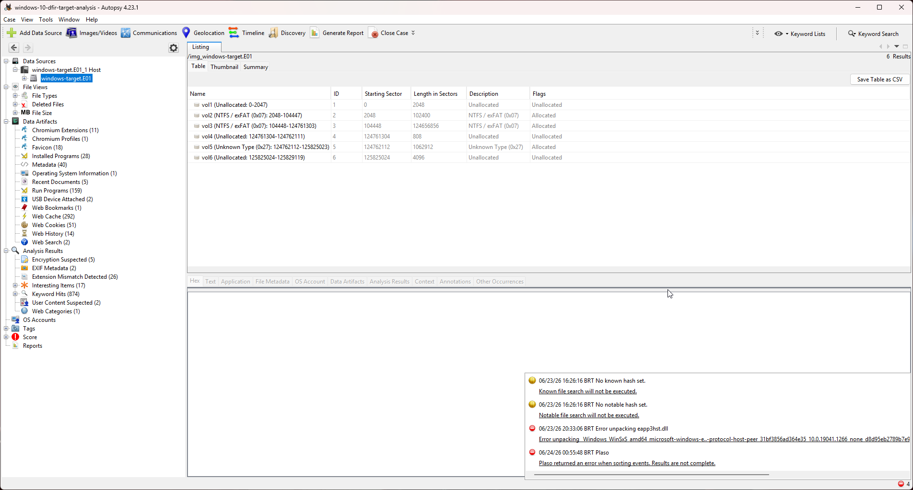
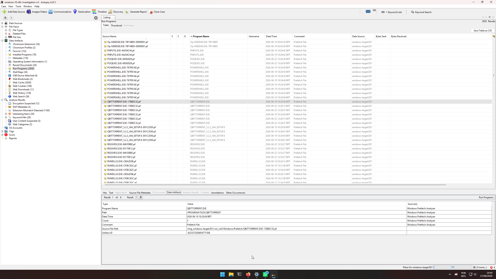
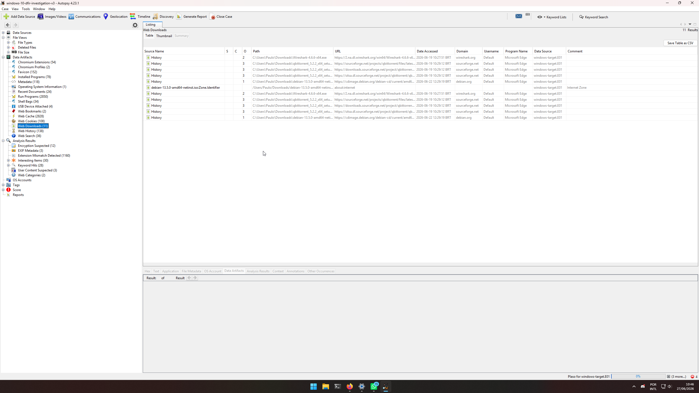
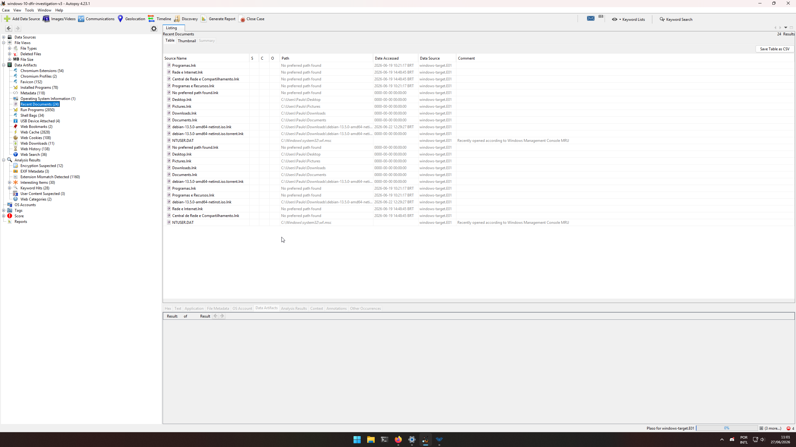
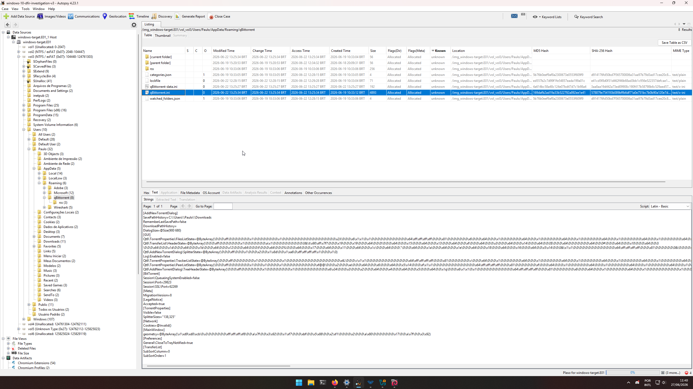
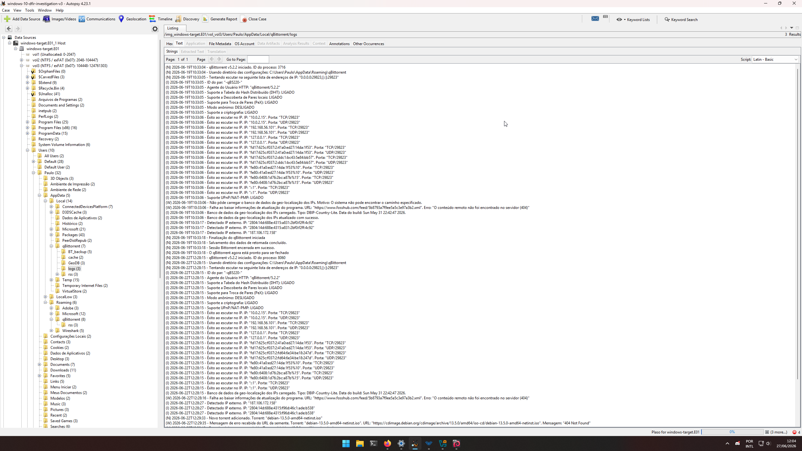
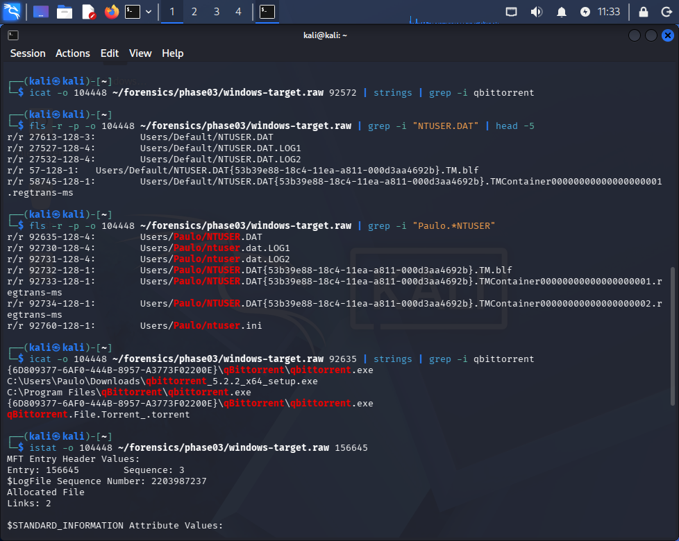
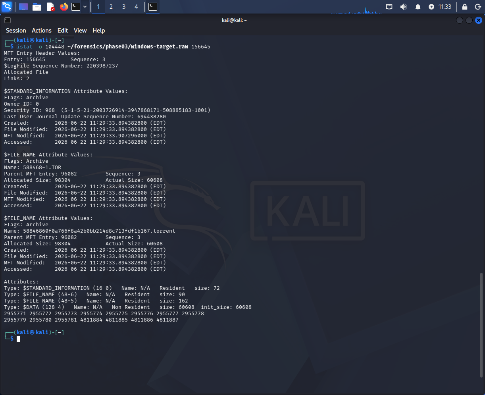
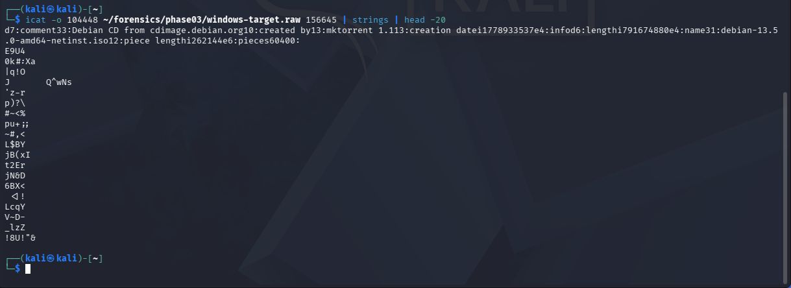

# Phase 04 — Disk Analysis

## Objective

Analyze the forensic image acquired in Phase 03 to recover artifacts proving that qBittorrent was installed, configured, and used to download `debian-13.5.0-amd64-netinst.iso` on the target system. Establish a precise activity timeline from disk evidence alone, to be correlated with network traffic in Phase 05.

**Tools used:** Autopsy 4.23.1, The Sleuth Kit (TSK) 4.14.0  
**Image:** `windows-target.E01` (9 segments, MD5: `8e01029edeadbfffb36fe8516afb54df`)  
**Autopsy case:** `windows-10-dfir-target-analysis-v3`  
**Partition offset:** `104448` (vol3, confirmed in Phase 03)

---

## Methodology Note — Dual-Tool Approach

Autopsy ingest was interrupted twice during this phase: once by a host machine shutdown at approximately 74% progress, and once when a UI display bug triggered an accidental confirmation of Autopsy's "Reset Windows" dialog, which closed the application mid-ingest. Each time Autopsy was reopened, the case database retained all previously indexed artifacts; ingest was restarted from scratch.

When the display bug recurred during the third ingest run, rather than risk another interruption, critical artifacts were confirmed via **TSK CLI on Kali Linux** as an independent validation method — specifically for Registry extraction (NTUSER.DAT / UserAssist) and .torrent file metadata. This approach is documented as methodological transparency: two independent tools reaching the same conclusions strengthens the evidentiary value of the findings.

---

## Step 1 — Image Loading and Partition Identification

The E01 image was loaded into Autopsy by pointing to the first segment (`windows-target.E01`). Autopsy automatically resolved the remaining segments (E02–E09) and identified the partition layout.



Autopsy identified 6 volumes. The forensically relevant partition is **vol3**: NTFS, starting sector `104448`, length 124,656,856 sectors — the primary Windows installation volume. This starting sector matches exactly the offset used for all TSK operations in Phase 03, confirming consistency across tools.

The notification panel at the bottom of the screen shows four ingest warnings logged during analysis:

- **No known / notable hash set** — non-critical; no hash database was configured for this investigation.
- **Error unpacking eapp3hst.dll** — a known Autopsy limitation with certain Windows PE files; did not affect artifact recovery.
- **Plaso returned an error when sorting events. Results are not complete.** — the Autopsy timeline module (powered by Plaso) failed to produce a complete event timeline. Mitigated by manually correlating artifact timestamps across individual data sources. This limitation is what motivated the cross-tool validation described above.

---

## Step 2 — Run Programs (Prefetch Analysis)

Autopsy's **Run Programs** module parses Windows Prefetch files (`C:\Windows\Prefetch\`) to recover program execution history. Prefetch files are created by the Windows Superfetch service the first time an executable runs; they record the program name, execution path, last run timestamp, and total run count.



Two qBittorrent-related Prefetch entries were recovered:

**`QBITTORRENT.EXE-17EBDC32.pf`**

| Field | Value |
|-------|-------|
| Program Name | `QBITTORRENT.EXE` |
| Path | `/PROGRAM FILES/QBITTORRENT` |
| First Run (Date/Time) | **2026-06-19 10:33:04 BRT** |
| Run Count | **3** |
| Comment | Prefetch File |

**`QBITTORRENT_5.2.2_X64_SETUP.E-D01C2050.pf`**

| Field | Value |
|-------|-------|
| Program Name | `QBITTORRENT_5.2.2_X64_SETUP.E` |
| Path | `/USERS/PAULO/DOWNLOADS` |
| Date/Time | 2026-06-19 10:56 BRT |

The installer Prefetch entry (`SETUP.E`) confirms the qBittorrent installer was executed from the Downloads folder — consistent with a user downloading and immediately running a setup file. The `QBITTORRENT.EXE` run count of 3 is consistent with the two sessions recorded in `qbittorrent.log` plus one additional invocation, likely the installer launching qBittorrent automatically after installation.

---

## Step 3 — Web Downloads

Autopsy's **Web Downloads** module recovers browser download history from Edge / Chrome / Firefox browser databases. Autopsy recovered **11 entries** from Microsoft Edge browser history.



Forensically relevant entries:

| File | URL | Timestamp (BRT) | Domain |
|------|-----|----------------|--------|
| `Wireshark-4.6.6-x64.exe` | `https://2.na.dl.wireshark.org/...` | **2026-06-19 10:27** | wireshark.org |
| `qbittorrent_5.2.2_x64_setup.exe` | `https://downloads.sourceforge.net/...` | **2026-06-19 10:29** | sourceforge.net |
| `debian-13.5.0-amd64-netinst.iso` | `https://cdimage.debian.org/...` | **2026-06-22 12:29** | cdimage.debian.org |
| `debian-13.5.0-amd64-netinst.iso.Zone.Identifier` | `about:internet` | 2026-06-22 12:29 | about:internet |

The three SourceForge entries for the qBittorrent installer represent CDN mirror redirects during a single download event — not three separate downloads. The download sequence (Wireshark at 10:27 → qBittorrent at 10:29) shows the user setting up the investigation environment in rapid succession.

The `Zone.Identifier` entry is an **Alternate Data Stream (ADS)** automatically attached to the ISO by Windows when files are downloaded via a browser. Zone ID 3 (Internet Zone) — indicated by `about:internet` as the source — is known as the **Mark of the Web (MotW)**. It proves the file originated from the internet and was not copied from a local device, USB drive, or network share.

---

## Step 4 — Recent Documents

Autopsy's **Recent Documents** module recovers `.lnk` (Shell Link) files from `%APPDATA%\Microsoft\Windows\Recent\`. Windows automatically creates these shortcut files whenever a user opens a file through Windows Explorer or a file dialog. Their presence is direct evidence of manual user interaction with the referenced files.



Autopsy recovered **24 Recent Documents** entries. Forensically relevant entries:

| File | Target Path | Date Accessed |
|------|------------|--------------|
| `debian-13.5.0-amd64-netinst.iso.lnk` | `C:\Users\Paulo\Downloads\debian-13.5.0-amd64-netinst.iso` | **2026-06-22 12:29 BRT** |
| `debian-13.5.0-amd64-netinst.iso.torrent.lnk` | `C:\Users\Paulo\Downloads\debian-13.5.0-amd64-netinst.iso.torrent` | — |

The presence of both `.iso.lnk` and `.iso.torrent.lnk` proves the user directly interacted with both files through the Windows shell. The `.iso.torrent` interaction is consistent with the user double-clicking the torrent file to open it in qBittorrent — the action that initiated the download recorded in the log at 12:29:33.

---

## Step 5 — qBittorrent Configuration (qBittorrent.ini)

The `qBittorrent.ini` file is qBittorrent's primary configuration file, stored in the user's roaming AppData profile. It persists session settings across application restarts.



File path: `Users/Paulo/AppData/Roaming/qBittorrent/qBittorrent.ini`

Key configuration values recovered:

```ini
[AddNewTorrentDialog]
SavePathHistory=C:\\Users\\Paulo\\Downloads

[BitTorrent]
Session\Port=29823
Session\SSL\Port=62269

[Meta]
MigrationVersion=8
```

**`Session\Port=29823`** — the P2P listening port. This is the port qBittorrent used for all incoming peer connections during the download. It is the primary Wireshark display filter for Phase 05: `tcp.port == 29823 or udp.port == 29823`.

**`SavePathHistory=C:\\Users\\Paulo\\Downloads`** — confirms all downloaded files were directed to the Downloads folder, consistent with the file paths found in Web Downloads and Recent Documents artifacts.

**`MigrationVersion=8`** — an internal version marker used by qBittorrent to track configuration schema upgrades. Value 8 is consistent with a standard qBittorrent 5.x installation.

---

## Step 6 — qBittorrent Application Log (qbittorrent.log)

The `qbittorrent.log` file is written by qBittorrent to record session events in plain text. It provides a precise, application-level timeline of all qBittorrent activity on the system.



File path: `Users/Paulo/AppData/Local/qBittorrent/logs/qbittorrent.log`

**Session 1 — 2026-06-19:**

```
10:33:04  qBittorrent v5.2.2 started. Process ID: 3716
10:33:05  Config dir: C:\Users\Paulo\AppData\Roaming\qBittorrent
10:33:05  Attempting to listen on port TCP/29823, UDP/29823
10:33:06  DHT: ENABLED | PeX: ENABLED | Encryption: ENABLED
10:33:06  Binding to IPs: 10.0.2.15, 192.168.56.101, 127.0.0.1
10:33:17  Detected external IP: 187.106.172.158
10:33:18  Session shutdown initiated
10:33:18  BitTorrent session ended successfully
```

Session 1 was brief — qBittorrent started, confirmed network connectivity and port binding, and was closed without adding any torrent. No download activity occurred. This session is consistent with a user testing the application immediately after installation.

**Session 2 — 2026-06-22:**

```
12:28:15  qBittorrent v5.2.2 started. Process ID: 8060
12:28:15  Attempting to listen on port TCP/29823, UDP/29823
12:28:15  DHT: ENABLED | PeX: ENABLED | Encryption: ENABLED
12:28:27  Detected external IP: 280b4:14d:688e:4315:a96d:46c1:adeb538 (IPv6)
12:29:33  New torrent added: "debian-13.5.0-amd64-netinst.iso"
12:29:35  Error from seeder URL: cdimage.debian.org — 404 Not Found
12:30:10  Download complete: "debian-13.5.0-amd64-netinst.iso"
```

The tracker 404 error at 12:29:35 is non-critical — it indicates the HTTP seeder URL was temporarily unavailable, but the torrent completed successfully via peer-to-peer connections from other seeders in the swarm. Download duration: **37 seconds** for 755 MiB, consistent with a high-speed residential connection.

---

## Step 7 — Registry UserAssist (TSK + NTUSER.DAT)

Windows records user interaction with programs and file types in the UserAssist registry key within `NTUSER.DAT`. Entries are ROT-13 encoded and contain execution counts and timestamps for programs launched via the Windows shell.

Because Autopsy's Registry module did not complete due to the ingest interruptions described above, UserAssist entries were extracted directly from the raw NTUSER.DAT binary using TSK.



**Finding NTUSER.DAT (Paulo's profile):**
```bash
fls -r -p -o 104448 ~/forensics/phase03/windows-target.raw | grep -i "Paulo.*NTUSER"
# r/r 92635-128-4:    Users/Paulo/NTUSER.DAT
```

**Extracting UserAssist strings:**
```bash
icat -o 104448 ~/forensics/phase03/windows-target.raw 92635 | strings | grep -i qbittorrent
```

Output:
```
{6D809377-6AF0-444B-8957-A3773F02200E}\qBittorrent\qbittorrent.exe
C:\Users\Paulo\Downloads\qbittorrent_5.2.2_x64_setup.exe
C:\Program Files\qBittorrent\qbittorrent.exe
{6D809377-6AF0-444B-8957-A3773F02200E}\qBittorrent\qbittorrent.exe
qBittorrent.File.Torrent_.torrent
```

`{6D809377-6AF0-444B-8957-A3773F02200E}` is the well-known GUID for the **Program Files** known folder. Its presence in UserAssist confirms qBittorrent was launched from the standard installation path `C:\Program Files\qBittorrent\qbittorrent.exe`, not a portable or suspicious location.

`qBittorrent.File.Torrent_.torrent` is a shell ProgID entry confirming that `.torrent` files were associated with qBittorrent and that the user opened at least one `.torrent` file through the Windows shell — consistent with the Recent Documents `.iso.torrent.lnk` artifact.

---

## Step 8 — NTFS Timestamps and Anti-Tampering Verification

NTFS maintains two independent sets of timestamps for each file: `$STANDARD_INFORMATION` (modifiable via standard Windows APIs) and `$FILE_NAME` (written only by the NTFS kernel driver and not accessible to userspace timestamp manipulation tools). Comparing the two is a standard method for detecting **timestomping** — a technique used by attackers to alter file timestamps and obscure activity.



```bash
istat -o 104448 ~/forensics/phase03/windows-target.raw 156645
```

**$STANDARD_INFORMATION timestamps:**

| Timestamp | Value (BRT) |
|-----------|------------|
| Created | **2026-06-22 12:29:33** |
| File Modified | **2026-06-22 12:29:33** |
| MFT Modified | **2026-06-22 12:29:33** |
| Accessed | **2026-06-22 12:29:33** |

**$FILE_NAME timestamps:**

| Timestamp | Value (BRT) |
|-----------|------------|
| Created | **2026-06-22 12:29:33** |
| File Modified | **2026-06-22 12:29:33** |
| MFT Modified | **2026-06-22 12:29:33** |
| Accessed | **2026-06-22 12:29:33** |

**$STANDARD_INFORMATION = $FILE_NAME → NO TIMESTOMPING DETECTED.**

The .torrent file was created naturally by the operating system. No post-creation timestamp manipulation is indicated.

Additional metadata confirmed by `istat`:
- **Inode:** 156645, Sequence: 3
- **Short name (8.3):** `588468~1.TOR`
- **Long name:** `58846860f0a766f8a42b0bb214d8c713fdf1b167.torrent`
- **Allocated size:** 98304 bytes | **Actual size:** 60608 bytes
- **Parent MFT Entry:** 96082

---

## Step 9 — .torrent File Content Extraction

The .torrent file was extracted from the raw image and its bencoded content was parsed to recover torrent metadata.



```bash
icat -o 104448 ~/forensics/phase03/windows-target.raw 156645 | strings | head -20
```

The first line of readable output contains the bencoded torrent metadata:

```
d7:comment33:Debian CD from cdimage.debian.org
10:created by13:mktorrent 1.1
13:creation datei1778933537e
4:name31:debian-13.5.0-amd64-netinst.iso
6:lengthi791674880e
12:piece lengthi262144e
6:pieces60400: [binary SHA-1 hashes follow]
```

| Field | Value | Notes |
|-------|-------|-------|
| comment | `Debian CD from cdimage.debian.org` | Official Debian torrent |
| created by | `mktorrent 1.1` | Tool used by Debian project to create the torrent |
| creation date | `1778933537` (Unix) | **2026-05-16** — when Debian created the torrent, not when Paulo downloaded it |
| name | `debian-13.5.0-amd64-netinst.iso` | Target file name |
| length | `791674880` bytes | 755 MiB |
| piece length | `262144` bytes | 256 KB per piece |
| pieces | 60400 SHA-1 hashes | One hash per 256KB piece for integrity verification |

The `creation date` in the torrent metadata refers to when the Debian project generated the torrent file (2026-05-16), not when the user downloaded it. The actual download timestamp is established independently via qbittorrent.log (12:29:33 BRT), NTFS `$STANDARD_INFORMATION` (12:29:33 BRT), and Web Downloads (12:29 BRT).

The filename `58846860f0a766f8a42b0bb214d8c713fdf1b167.torrent` is the **SHA-1 info-hash** of the torrent — the unique identifier used by the BitTorrent protocol to identify this specific torrent in the DHT network and among peers. This value will be used in Phase 05 to correlate disk evidence with BitTorrent handshake packets in the network capture.

---

## Summary of Findings

| Artifact | Key Value | Source |
|----------|-----------|--------|
| .torrent file | Inode 156645, path `BT_backup/58846860...torrent` | TSK fls |
| Torrent metadata | debian-13.5.0-amd64-netinst.iso, 755 MiB, info-hash SHA-1 | TSK icat |
| qBittorrent first run | **2026-06-19 10:33:04 BRT** | Prefetch (Autopsy) |
| Prefetch run count | 3 executions | Prefetch (Autopsy) |
| Wireshark downloaded | **2026-06-19 10:27 BRT** via wireshark.org | Web Downloads (Autopsy) |
| qBittorrent downloaded | **2026-06-19 10:29 BRT** via sourceforge.net | Web Downloads (Autopsy) |
| Debian ISO downloaded | **2026-06-22 12:29 BRT** via cdimage.debian.org | Web Downloads (Autopsy) |
| Mark of the Web | Zone ID 3 (Internet) on .iso file | Zone.Identifier ADS (Autopsy) |
| User interaction | .iso.lnk + .iso.torrent.lnk | Recent Documents (Autopsy) |
| P2P port | **29823** (TCP + UDP) | qBittorrent.ini + log (Autopsy) |
| Torrent added | **2026-06-22 12:29:33 BRT** | qbittorrent.log + NTFS $SI + Web Downloads |
| Download complete | **2026-06-22 12:30:10 BRT** | qbittorrent.log |
| Download duration | **37 seconds** (755 MiB) | qbittorrent.log |
| Timestomping | **Not detected** ($SI = $FN) | TSK istat |
| UserAssist | qbittorrent.exe launched from Program Files; .torrent file type associated | TSK icat (NTUSER.DAT) |

---

## Key Identifiers for Phase 05 — Network Analysis

| Item | Value |
|------|-------|
| Wireshark filter | `tcp.port == 29823 or udp.port == 29823` |
| Info-hash | `58846860f0a766f8a42b0bb214d8c713fdf1b167` |
| Download window | **2026-06-22 12:29:33 – 12:30:10 BRT** (37 seconds) |
| Source IP (NAT) | `10.0.2.15` |
| Source IP (host-only) | `192.168.56.101` |
| pcap file | `qbitorrent-debian.pcapng` (~585,916 packets) |

---

→ [Phase 05 — Network Analysis](../phase05-network-analysis/phase05-network-analysis.md)
