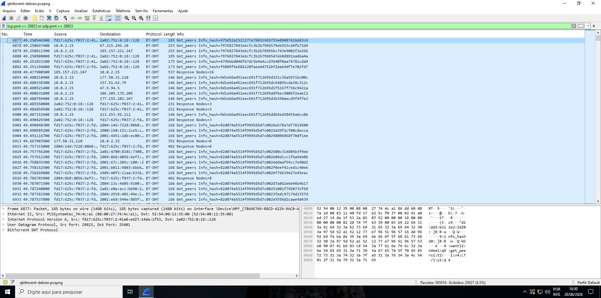
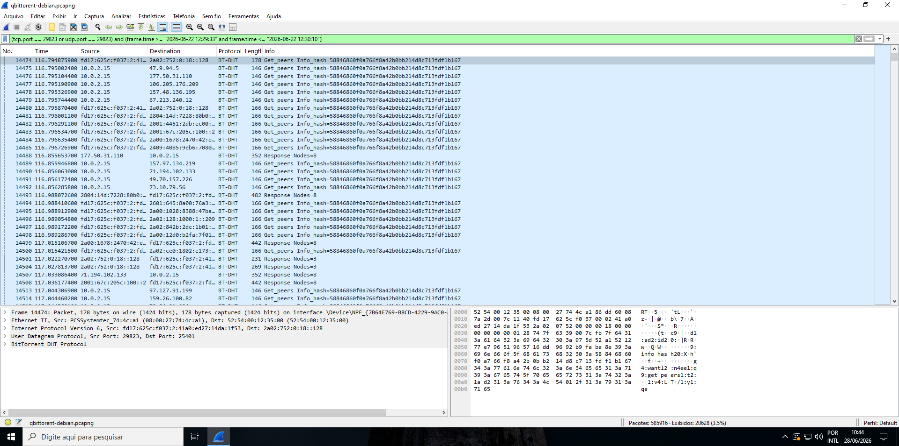
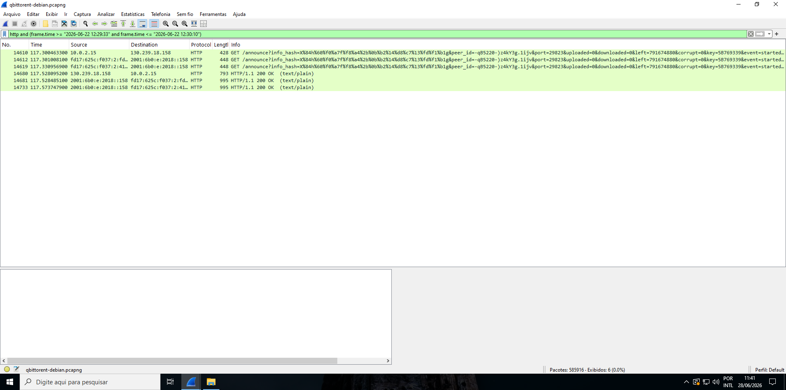
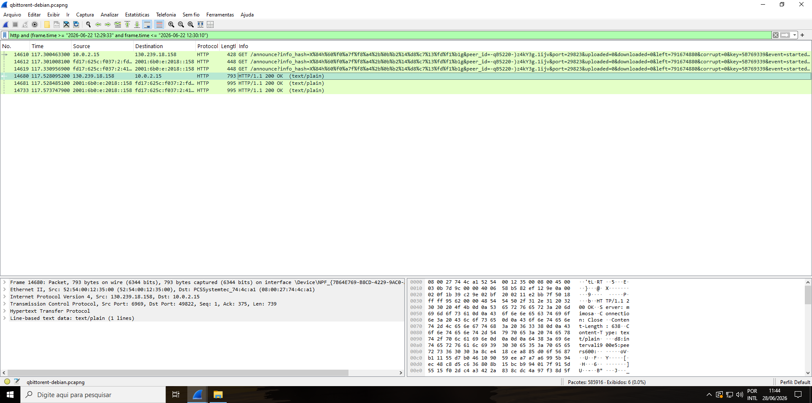
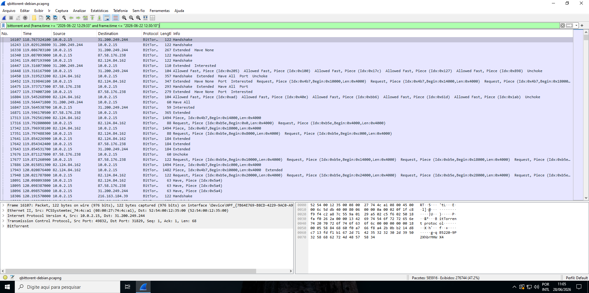
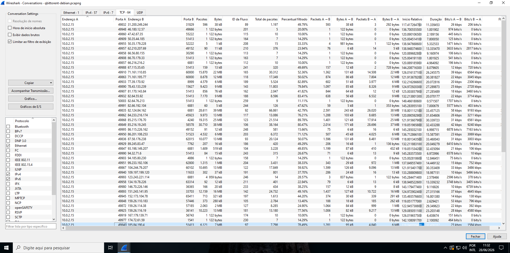
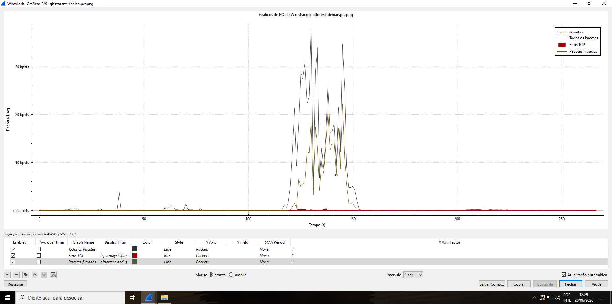

# Phase 05 — Network Analysis

## Objective

Analyze the network capture `qbitorrent-debian.pcapng` to recover evidence of BitTorrent activity at the network layer, correlating it with the disk artifacts established in Phase 04. The goal is to confirm — through independent network evidence — that the target system downloaded `debian-13.5.0-amd64-netinst.iso` via the BitTorrent protocol during the window established by disk analysis (2026-06-22 12:29:33–12:30:10 BRT).

**Tool:** Wireshark 4.6.6  
**Capture file:** `qbitorrent-debian.pcapng` (585,916 packets)  
**Analysis machine:** Windows 10 target VM (see Methodology Note)

---

## Methodology Note — Analysis on Evidence-Generating Machine

Standard forensic procedure requires transferring network captures to a dedicated investigator workstation prior to analysis, with hash verification before and after the transfer to ensure integrity. Analysis is never performed on the machine that generated the evidence.

In this investigation, this procedure was not followed, for the following documented reasons:

**Why we deviated:** Wireshark 4.6.6 was installed exclusively on the Windows 10 target VM. The Kali investigator VM was not configured with Wireshark for this phase. The investigation runs in a controlled, single-investigator lab environment with no adversarial parties — there is no risk of evidence tampering between collection and analysis by a third party.

**Why it would matter in a real case:** Any interaction with the evidence-generating machine after collection creates a risk of modifying artifacts — filesystem timestamps, memory state, application logs. In an adversarial legal context, this could be challenged as contamination of the evidentiary record, potentially invalidating the chain of custody for all artifacts from that machine.

**What the correct procedure would be:** Copy `qbitorrent-debian.pcapng` to the Kali investigator VM → compute SHA-256 hash of the original → copy → compute SHA-256 of the copy → verify hashes match → perform all analysis exclusively on the copy, never touching the original again.

**Mitigating factor:** The pcap is a secondary evidence artifact generated deliberately as part of the investigation scenario. The primary forensic image (`windows-target.E01`, MD5: `8e01029edeadbfffb36fe8516afb54df`) resides on the Kali VM and was handled with full forensic discipline throughout Phase 03. The pcap analysis results are corroborated by disk artifacts from three independent sources (qbittorrent.log, NTFS timestamps, Web Downloads), making the network evidence confirmatory rather than the sole basis for any finding.

**This deviation is explicitly acknowledged and would not be acceptable in a production forensic or legal environment.** It is documented here and in `chain-of-custody.md` as a deliberate, reasoned exception in a controlled lab context.

---

## Step 1 — Loading the Capture and Initial Filtering

The capture file `qbitorrent-debian.pcapng` was opened in Wireshark. The file contains **585,916 packets** spanning the full Wireshark capture session (12:27–12:32 BRT). The download of interest occurred between 12:29:33 and 12:30:10 BRT — a 37-second window buried within the full capture.

The primary display filter was applied to isolate traffic on the qBittorrent P2P port established in Phase 04:

```
tcp.port == 29823 or udp.port == 29823
```

This port was confirmed in Phase 04 from two independent disk artifacts: `qBittorrent.ini` (`Session\Port=29823`) and `qbittorrent.log` (`Attempting to listen on port TCP/29823, UDP/29823`).



**Result: 25,027 packets (4.3% of total capture).** The protocol column shows `BT-DHT` — BitTorrent Distributed Hash Table traffic over UDP. The Info column shows `Get_peers Info_hash=...` queries with multiple different info-hashes, indicating the DHT node was participating in the broader BitTorrent network beyond just the Debian torrent. This is normal DHT behavior — a node maintains routing table entries for many torrents simultaneously.

### Note on TCP Port 29823 — Zero Results

Filtering for `tcp.port == 29823` alone within the download window returned **zero results**. This is not an error and requires explanation.

Port 29823 is qBittorrent's **inbound listening port** — the port on which it accepts incoming peer connections. When qBittorrent initiates outbound connections to peers, the operating system assigns **ephemeral ports** (dynamically allocated, above 49152) as the source port on the client side. The destination port is whatever port the remote peer is listening on.

In this download, the client was primarily **active** — it connected outbound to peers rather than waiting for peers to connect inbound. Therefore, port 29823 appears in UDP/DHT traffic (as the source port for DHT queries) but not in TCP peer connections (where outbound connections used ephemeral ports). The actual BitTorrent piece exchange occurred over TCP connections using ephemeral source ports — identified in later steps by filtering on the BitTorrent protocol rather than the port number.

---

## Step 2 — Isolating the Download Window

The filter was refined to isolate the exact 37-second download window established from disk evidence:

```
(tcp.port == 29823 or udp.port == 29823) and (frame.time >= "2026-06-22 12:29:33" and frame.time <= "2026-06-22 12:30:10")
```



**Result: 20,628 packets (3.5% of total capture).** The critical observation: within this window, every `Get_peers` packet in the Info column carries the **same info-hash**:

```
58846860f0a766f8a42b0bb214d8c713fdf1b167
```

This is identical to the filename of the `.torrent` file recovered from disk in Phase 04 — `58846860f0a766f8a42b0bb214d8c713fdf1b167.torrent`, inode 156645. The DHT network was actively queried for peers for this specific torrent during the exact window the application log records as the download period. This is the first disk↔network correlation point.

---

## Step 3 — Tracker HTTP Communication

HTTP traffic was filtered within the download window to locate the tracker announce:

```
http and (frame.time >= "2026-06-22 12:29:33" and frame.time <= "2026-06-22 12:30:10")
```



**Six HTTP packets recovered.** Three outbound `GET /announce` requests were sent to `130.239.18.158` on **port 6969** — the standard BitTorrent HTTP tracker port. The announce URL contains the following parameters (decoded from URL encoding):

| Parameter | Value | Significance |
|-----------|-------|-------------|
| `info_hash` | `58846860f0a766f8a42b0bb214d8c713fdf1b167` | Identifies the torrent |
| `peer_id` | `-qB5220-...` | **qBittorrent version 5.2.20** — independent client identification |
| `port` | `29823` | Listening port declared to tracker — matches disk artifacts |
| `uploaded` | `0` | No data uploaded — download just beginning |
| `downloaded` | `0` | No data downloaded yet |
| `left` | `791,674,880` | Bytes remaining = **755 MiB** — matches `.torrent` bencoding from Phase 04 |
| `event` | `started` | First announce, download starting |

The `peer_id` field independently identifies the client as qBittorrent version 5.2.2 — corroborating the Prefetch artifact (`QBITTORRENT.EXE-17EBDC32.pf`) and the application log from Phase 04. This is a fourth independent source confirming the same client software.

### Tracker Response — 100 Peers Returned



**Frame 14680 — HTTP/1.1 200 OK** from `130.239.18.158:6969`:

- **Server:** `mimosa` (tracker software)
- **Content-Length:** 638 bytes
- **peers:** 600 bytes of compact peer encoding

In the BitTorrent compact peer format, each peer is encoded as 6 bytes (4 bytes IPv4 address + 2 bytes port). 600 bytes ÷ 6 = **100 peers** returned by the tracker in a single response.

### Important Clarification — Tracker vs. Web Seed

The `qbittorrent.log` from Phase 04 recorded a `404 Not Found` error at 12:29:35 from `cdimage.debian.org`. This requires precise interpretation against the pcap evidence:

The tracker (`130.239.18.158:6969`) responded with `200 OK` — **tracker communication was fully successful.** The `404` error in the log originated from a **web seed** — a separate HTTP URL declared in the torrent's `url-list` metadata field that points directly to a file download URL on `cdimage.debian.org`. Web seeds allow BitTorrent clients to download file data directly via HTTP as a fallback, bypassing peer-to-peer entirely. In this case, the web seed URL was temporarily unavailable (404), but the download completed successfully because the tracker returned 100 peers and DHT provided additional peer discovery. Tracker and web seed are entirely distinct mechanisms — the log error reflects web seed failure, not tracker failure.

---

## Step 4 — BitTorrent Handshake and Piece Exchange

The filter was broadened to capture all BitTorrent protocol traffic within the download window:

```
bittorrent and (frame.time >= "2026-06-22 12:29:33" and frame.time <= "2026-06-22 12:30:10")
```



**Result: 276,744 packets (47.2% of total capture).** The full BitTorrent protocol exchange is visible in the Info column, including Handshake, Extended, Have None, Interested, Unchoke, Allowed Fast, Request, Piece, and Have messages.

### The Handshake — Info-Hash in Network Payload

The first BitTorrent handshake was observed at **frame 16107** (relative timestamp 118.77s). The hex dump of this packet shows:

- **Offset 0x30:** `42 69 74 54 6f 72 72 65 6e 74 20 70 72 6f 74 6f 63 6f 6c` = `BitTorrent protocol` — confirming this is a valid BitTorrent handshake
- **Offsets 0x50–0x60:** `58 84 68 60 f0 a7 66 f8 a4 2b 0b b2 14 d8 c7 13 fd f1 b1 67` = **`58846860f0a766f8a42b0bb214d8c713fdf1b167`**

The info-hash is transmitted **in clear text** in every BitTorrent handshake. Finding this exact value — previously recovered from disk — in the TCP payload of a network packet captured during the download window is the definitive disk↔network correlation: the same torrent identifier appears in both evidence sources independently.

### Protocol Message Sequence

The complete expected BitTorrent message sequence was observed:

| Message | Meaning |
|---------|---------|
| `Handshake` | Identity exchange, info-hash confirmation between peers |
| `Have None` | Peer declares it has no pieces yet (just joined the swarm) |
| `Interested` | Client declares it wants pieces the peer has |
| `Unchoke` | Peer unblocks the client — data transfer authorized to begin |
| `Allowed Fast` | Peer pre-authorizes specific pieces for immediate download without choking |
| `Request` | Client requests a specific piece by index, byte offset, and length |
| `Piece` | Peer delivers the requested piece data |
| `Have` | Either party announces completion of a specific piece |

This sequence is consistent with a normal, unmanipulated BitTorrent download. No anomalous protocol behavior was observed.

---

## Step 5 — TCP Peer Connections

Peer connections were analyzed via **Statistics → Conversations → TCP tab**.



**64 TCP connections** were established from `10.0.2.15` to external peers during the download window. All outbound connections used ephemeral source ports (>49152). The full peer list — including IP addresses, ports, packet counts, byte volumes transferred in each direction, connection start times, and durations — is documented in `peers.csv` (included in this phase folder).

Top peers by data volume received (Bytes B→A):

| Peer IP | Approximate Volume |
|---------|-------------------|
| 152.173.104.78 | ~321 MB |
| 82.124.84.162 | ~39 MB |
| 82.64.35.92 | ~39 MB |
| 85.216.19.245 | ~38 MB |

The distribution of data across 64 peers is characteristic of BitTorrent's parallel piece-downloading strategy — pieces are requested from multiple peers simultaneously to maximize throughput.

### Peer IP Correlation with Disk Artifacts

A targeted search was performed in `qbittorrent.log` (Phase 04) for the IP addresses of the most active peers identified in the pcap. **No peer IP addresses were found in the application log.** This is expected: qBittorrent logs session-level events but does not record individual peer connection IPs.

The disk↔network correlation in this investigation is therefore established through four convergent data points that do not require individual peer IP logging:

1. **Info-hash** — identical in `.torrent` filename on disk (Phase 04) and in BitTorrent TCP handshake payload (Phase 05, frame 16107)
2. **Temporal window** — disk artifacts and network activity converge on the same 37-second window (12:29:33–12:30:10 BRT)
3. **Port declaration** — port 29823 in `qBittorrent.ini` and `qbittorrent.log` matches `port=29823` in tracker announce
4. **File size** — `length=791674880` in `.torrent` bencoding matches `left=791674880` in tracker announce

---

## Step 6 — I/O Graph: Traffic Volume Verification

The Wireshark I/O graph was generated with the BitTorrent download window filter active.



The graph shows three distinct periods:

**Pre-download (0–~120s):** Near-zero packet rate with occasional small spikes — background DHT traffic and application activity before the torrent was added.

**Download burst (~120–150s):** Sharp spike to approximately **35,000 packets/second**, sustained for ~30 seconds before dropping. The filtered line (BitTorrent traffic in the download window) overlaps directly with the spike, confirming the burst is caused by BitTorrent piece exchange. TCP error packets (red bar) appear within this window — consistent with retransmissions and timeouts expected during high-speed parallel transfer across 64 simultaneous peer connections.

**Post-download (~150s onward):** Immediate return to near-zero — the download completed and piece exchange ceased.

The burst duration (~30s visible in the graph) is consistent with the 37-second download window established from disk. The slight discrepancy is attributable to the graph's 1-second interval binning and the ramp-up/ramp-down at the start and end of the download.

This graph provides independent graphical confirmation that a high-volume BitTorrent data transfer occurred precisely within the window documented by disk artifacts.

---

## Summary of Findings

| Finding | Evidence | Frame/Source |
|---------|----------|-------------|
| DHT queries for target info-hash during download window | 20,628 BT-DHT packets, all with `58846860...` | Frames 14474+ |
| Tracker announce with info-hash, port 29823, left=755MiB | HTTP GET /announce to 130.239.18.158:6969 | Frame 14610 |
| Client identified as qBittorrent 5.2.2 via peer_id | `-qB5220-` in tracker announce | Frame 14610 |
| Tracker returned 100 peers (200 OK, peers600) | HTTP response, Server: mimosa | Frame 14680 |
| Info-hash in BitTorrent TCP handshake payload | Hex dump offsets 0x50–0x60 | Frame 16107 |
| 64 TCP peer connections established | TCP Conversations table | `peers.csv` |
| Download burst correlated with 37-second window | I/O graph spike at ~120–150s | Screenshot 26 |
| No peer IPs in application log | Verified via qbittorrent.log search | Negative finding |
| Web seed 404 ≠ tracker failure | Tracker returned 200 OK; 404 was web seed | Frames 14610/14680 |

---

## Deliverables

| File | Description |
|------|-------------|
| `screenshots/20-wireshark-dht-port-filter-multiple-hashes.png` | DHT general activity, primary port filter |
| `screenshots/21-wireshark-dht-download-window-single-hash.png` | DHT isolated to download window, single info-hash |
| `screenshots/22-wireshark-tracker-http-announce-response.png` | Tracker HTTP announce requests |
| `screenshots/23-wireshark-tracker-response-peers-detail.png` | Tracker 200 OK response, peers600 detail |
| `screenshots/24-wireshark-bittorrent-handshake-piece-exchange.png` | Handshake + piece exchange + info-hash in hex |
| `screenshots/25-wireshark-tcp-conversations-peers.png` | TCP conversations, 64 peers, byte volumes |
| `screenshots/26-wireshark-io-graph-download-burst.png` | I/O graph, download burst correlation |
| `peers.csv` | Complete TCP peer list exported from Wireshark |

---

## Key Identifiers for Phase 06 — Timeline and Report

| Item | Value |
|------|-------|
| Info-hash (network confirmed) | `58846860f0a766f8a42b0bb214d8c713fdf1b167` |
| Tracker IP | `130.239.18.158:6969` |
| Download window (network confirmed) | 2026-06-22 12:29:33 – 12:30:10 BRT |
| Peer connections | 64 TCP connections (see `peers.csv`) |
| Client identifier (network) | `-qB5220-` = qBittorrent 5.2.2 |
| Peak transfer rate | ~35,000 packets/second |

---

*Phase 05 — BitTorrent DFIR Investigation*
